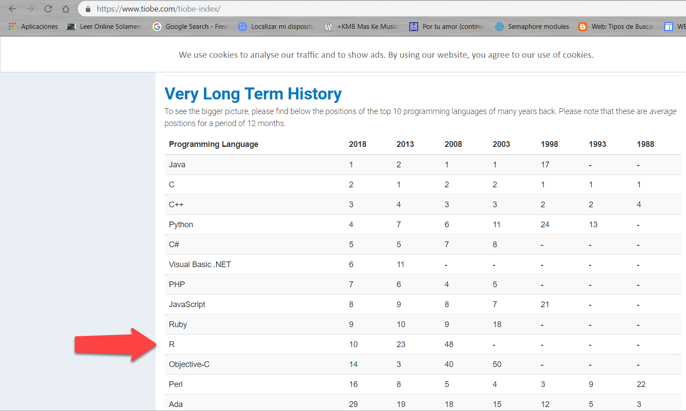
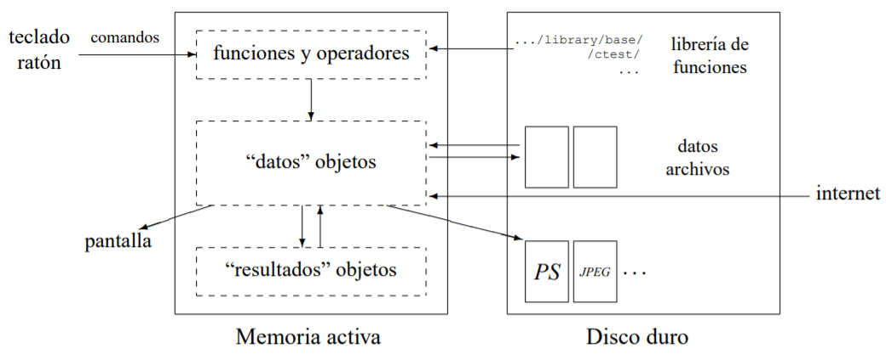

### 1. [Introducción al lenguaje y ambiente R](https://www.r-project.org/about.html).
## ¿Qué es R?
R es un lenguaje y entorno para computación estadística y gráficos. Es un proyecto GNU que es similar al lenguaje y el entorno S que fue desarrollado en los Laboratorios Bell (anteriormente AT&T, ahora Lucent Technologies) por John Chambers y sus colegas. R puede considerarse como una implementación diferente de S. Hay algunas diferencias importantes, pero gran parte del código escrito para S se ejecuta sin alterar en R.

R proporciona una amplia variedad de técnicas estadísticas (modelado lineal y no lineal, pruebas estadísticas clásicas, análisis de series de tiempo, clasificación, agrupación, ...) y técnicas gráficas, y es altamente extensible. El lenguaje S suele ser el vehículo elegido para la investigación en metodología estadística, y R proporciona una ruta de código abierto para participar en esa actividad.

Una de las fortalezas de R es la facilidad con la que se pueden producir gráficos de calidad de publicación bien diseñados, incluyendo símbolos matemáticos y fórmulas donde sea necesario. Se ha prestado gran atención a los valores predeterminados para las opciones de diseño menores en gráficos, pero el usuario conserva el control total.

R está disponible como Software Libre bajo los términos de la Licencia Pública General GNU de Free Software Foundation en forma de código fuente. Compila y se ejecuta en una amplia variedad de plataformas UNIX y sistemas similares (incluidos FreeBSD y Linux), Windows y MacOS.

[R es un conjunto integrado de herramientas de software para la manipulación de datos, el cálculo y la visualización gráfica. 
El término *ambiente* pretende caracterizarlo como un sistema totalmente planificado y coherente, en lugar de una acumulación incremental de herramientas muy específicas e inflexibles, como suele ser el caso con otros programas de análisis de datos](https://cran.r-project.org/doc/manuals/R-intro.html#Introduction-and-preliminaries).

R es en gran medida un vehículo para los nuevos métodos de análisis de datos interactivos. Se ha desarrollado rápidamente y se ha extendido por una gran colección de paquetes. Sin embargo, la mayoría de los programas escritos en R son esencialmente efímeros, escritos para una sola pieza de análisis de datos.

"En particular, R tiene:

*  Una herramienta efectiva de manejo y almacenamiento de datos

*  Una serie de operadores para hacer cálculos en arreglos y matrices

*  Una colección extensa, coherente e integrada de herramientas intermedias para analizar datos

*  Herramientas gráficas para análisis y exhibición de datos, ya sea en una computadora o en otro tipo de presentaciones

*  Un lenguaje de programación simple, efectivo y bien desarrollado (llamado 'S') que nos permite utilizar estructuras de control."

*R es software libre*: 

*  Mayor velocidad de actualizaciones y mejoras
*  Mayor documentación disponible en línea
*  Producción de programas con menos errores
*  Capacidad para modificar el software y adaptarlo a nuestras necesidades

#### 2. ¿Por qué me importa?

*  Ocupa el lugar 10, del top ten de los lenguajes de programación según [The TIOBE Programming Community index](https://www.tiobe.com/tiobe-index/) (is an indicator of the popularity of programming languages).

### 3. R está hecho para quienes no son programadores
A diferencia de lenguajes como C, C++, Python o Julia, R no está diseñado para quienes dominan la sintáxis, sino para quienes leemos el resultado. Eso nos obliga a ser más cuidadosos, pero también es una ventaja al transitar la curva de aprendizaje, además de que permite realizar operaciones poco convencionales.

### 4. R compatible con otros softwares
En gran parte, gracias a personas como [Hadley Wickam](https://github.com/hadley), R se ha vuelto una excelente opción para hablar con otros tipos de software. Algunos ejemplos:

*  [Excel](https://github.com/hadley/readxl)

*  [Java](https://github.com/hadley/rJava)

*  [plot.ly](https://plot.ly/)

*  [Github](https://github.com/hadley/devtools)

*  STATA, Octave, SPSS, SAS 

*  Drive, Google Spreadsheets

### 5. Comunicación rápida de resultados
A raíz de la adecuación de Markdown a R, surgió una herramienta valiosísima y fácil de usar para comunicar nuestro trabajo: [RMarkdown](http://rmarkdown.rstudio.com/). A través de ella, podemos ejecutar código de R y "guardar" los resultados de este en el formato que decidamos. 

### 6. ¿Cómo funciona?
R es un lenguaje Orientado a Objetos: bajo este complejo termino se esconde la simplicidad y flexibilidad de R. 
* R es un lenguaje interpretado (como Java) y no compilado (como C,C++, Fortran, Pascal, . . . ), lo cual significa que los comandos escritos en el teclado son ejecutados
directamente sin necesidad de construir ejecutables
* La sintaxis de R es muy simple e intuitiva. Por ejemplo, una regresión lineal se puede ejecutar con el comando lm(y ˜x). Para que una función sea ejecutada en R debe estar siempre acompanada de paréntesis, inclusive en el caso que no haya nada dentro de los mismos (por ej., ls()). Si se escribe el nombre de la funcion sin los parénntesis, R mostrará el contenido (codigo) mismo de la función.

*Orientado a Objetos* significa que las variables, datos, funciones, resultados, etc., se guardan en la memoria activa del computador en forma de objetos con un nombre específico. El usuario puede modificar o manipular estos objetos con operadores (aritmeticos, lógicos, y comparativos) y funciones (que a su vez son objetos).

* Todas las acciones en R se realizan con objetos que son guardados en la memoria activa de la computadora, sin usar archivos temporales.
* La lectura y escritura de archivos solo se realiza para la entrada y salida de datos y resultados (graficas, etc ). 
* El usuario ejecuta las funciones con la ayuda de comandos definidos. Los resultados se pueden visualizar directamente en la pantalla, guardar en un objeto o escribir directamente en el disco (particularmente para gráficos). 
* Debido a que los resultados mismos son objetos, pueden ser considerados como datos y analizados como tal. Archivos que contengan datos pueden ser leidos directamente desde el disco local o en un
servido remoto a través de la red.
