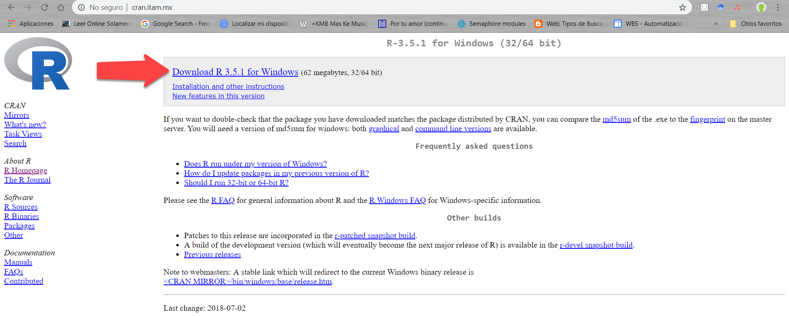
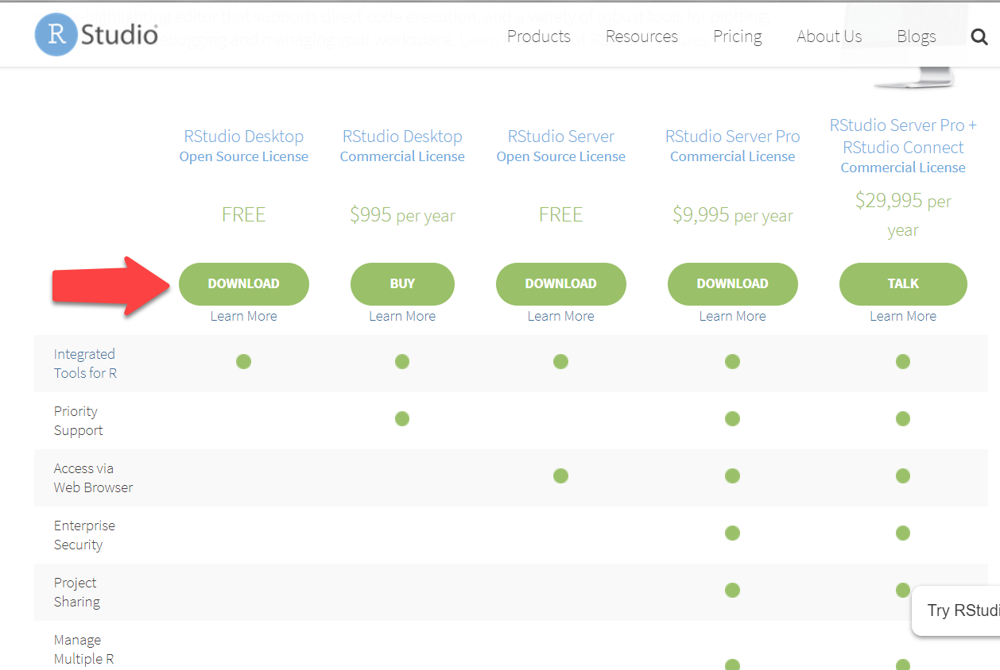
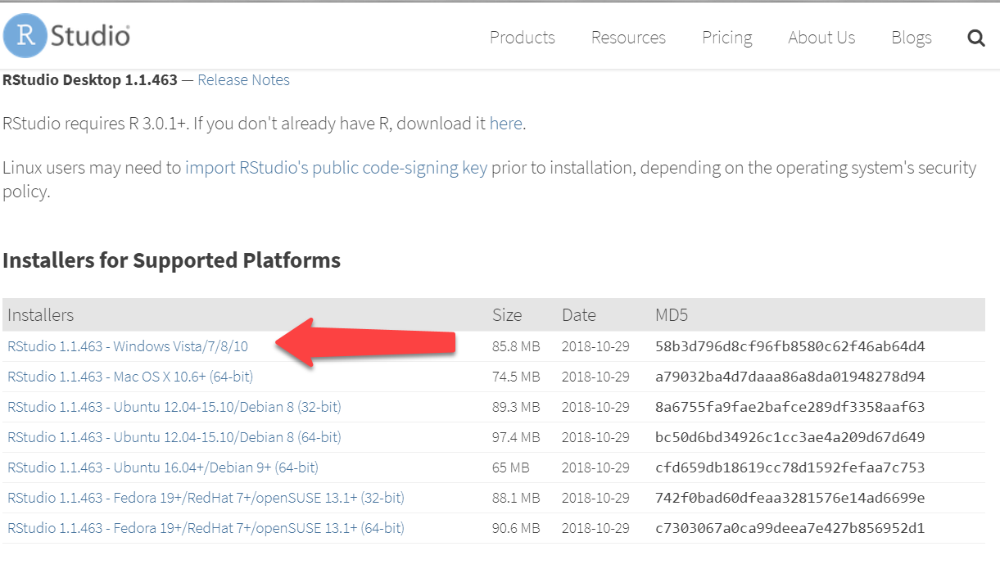

## 1. ¿Cómo se instala R?
#### 1.1 Windows
 - Ir a la dirección http://www.r-project.org/ en tu navegador.
 - Click en la opción Download/CRAN. Se va a desplegar un listado de los servidores en donde se puede descargar el ejecutable. De preferencia utilicen https://cran.itam.mx/
 - Click en la opción Download R for Windows.
 - Click en la opción base.
 
 

- Click en el link para descargar la última versión de R. Se descargará un archivo ejecutable (.exe).
 - Cuando se complete la descarga, dar doble click en el archivo y contestar las preguntas usuales para la instalación.
 - Probar que se haya instalado correctamente.
```r
> 3+3
[1] 6
```

#### 1.2 OS X
 - Ir a la dirección http://www.r-project.org/ en tu navegador.
 - Click en la opción Download/CRAN. Se va a desplegar un listado de los servidores en donde se puede descargar el ejecutable. De preferencia utilicen https://cran.itam.mx/
 - Click en la opción Download R for (Mac) OS X
 - Click en el link de descarga del archivo .pkg. Una vez que la descarga se haya completado, dar doble click en el archivo .pkg y contestar las preguntas usuales de la instalación.

#### 1.3 Linux Ubuntu
 - Abrir una terminar y ejecutar los siguientes comandos:
 ``` r
 sudo apt-get -y install r-base r-base-dev
```
## 2. Entorno Gráfico IDE's
#### 2.1 Ejemplos de IDE's
* R Studio
* Jupyter Notebook
* Visual Studio for R
* Eclipse

#### 2.2 Instalación de RStudio

Puedes descargar [RStudio](https://www.rstudio.com/products/rstudio/download/) siguiendo las instrucciones para cada sistema operativo. 
En nuestro caso, seleccionar la opción para Windows.
 

 

##### 2.2.1 ¿Qué incluye?
RStudio es un IDE (integrated development environment) para R que incluye:
- consola, 
- editor de texto, 
- memoria de gráficos, 
- vista de objetos en el ambiente y 
- otras herramientas útiles para desarrollar. 
En su versión más reciente, también autocompleta código y debuggea al vuelo.

Aguas con el uso de la memoria *RAM* de este editor pues abusa bastante y -cuando están usando una gran cantidad de datos o procesos muy pesados- RStudio suele tronar fácilmente. Buenas prácticas de todos los días: guarden seguido, sigan un workflow aunado a controlador de versiones (o algún tipo de backup) y, sobretodo, creen sus funciones, lógica, algoritmos, con una muestra de sus datos.

##### 2.2.2 ¿Qué se puede hacer en RStudio?
- Scripts de Análisis de Datos
- Aplicaciones web interactivas
- Documentos
- Reportes
- Gráficas
